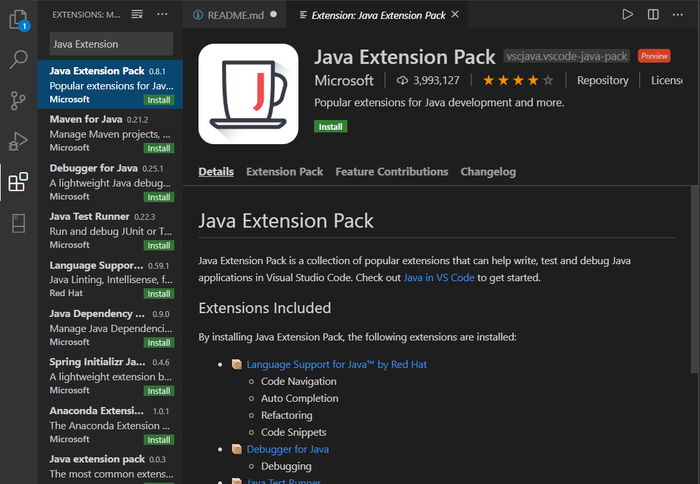
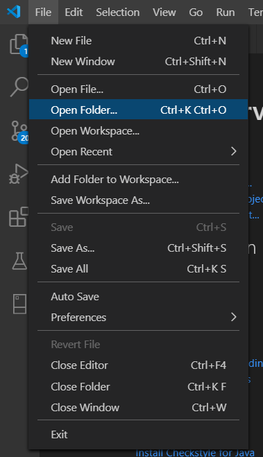
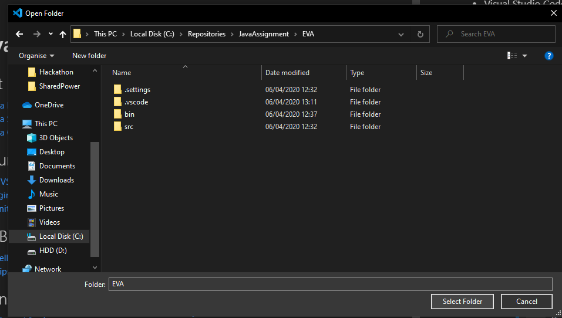
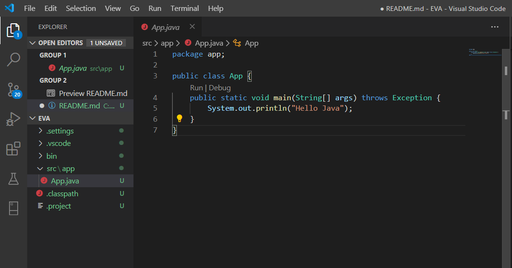

## Attention
Before anything else, I would just like to ask you all not to use the git extension in VSCode, that can really mess up this project if you don't know what you are doing there. Please read the [GitHub Readme](../1-GitHub/README.md), thank you.
# Getting Started
## Installation Requirements
To get started you need to install the following:

- Java SE Development Kit 13.0.2 (Please use the same version)
    > [Link](https://www.oracle.com/java/technologies/javase-jdk13-downloads.html)

- Visual Studio Code (VScode)
    > [Link](https://visualstudio.microsoft.com/downloads/)

- [**Java Extension Pack**](https://marketplace.visualstudio.com/items?itemName=vscjava.vscode-java-pack) Plugin in VScode.
    - > ##### You can manually install the extension pack from the Extensions view (Ctrl+Shift+X) by typing "Java Extension Pack" in the search box.
        > 

## Opening the Project
In order to get everything working consistently please do the following:
- Before starting to code anything, make sure that your repository is up-to-date with the ***master***, if you're going to be working on branches, as you might, make sure that your branch is up-to-date with the master, if possible.

- All you have to do to ensure that VScode loads all of the project settings is to open the folder of the Project, to do that just navigate to where the project `.../EVA/` is and click `Select Folder`.
> 

> 
- At the end your VScode should look a little like this:
> 

