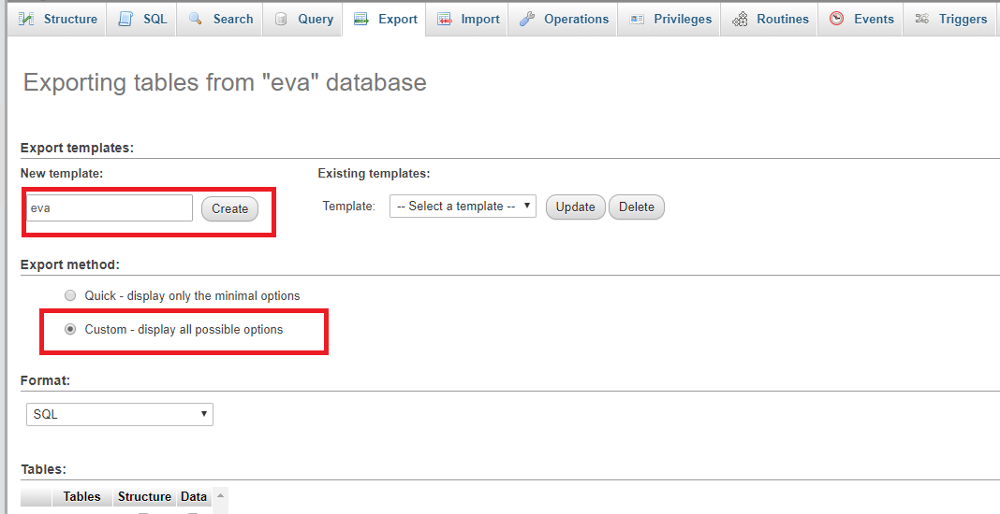

# How to export mySQL from phpMyAdmin

1. Click on `Export`:

2. Enter the name of the database that you want to export and select `Custom` export.

3. Click on view output as text (optional):

4. Scroll down and click `Go`.

5. Copy the code generated and paste it into a file with `.sql` as extension. i.e.: `mySql.sql`

