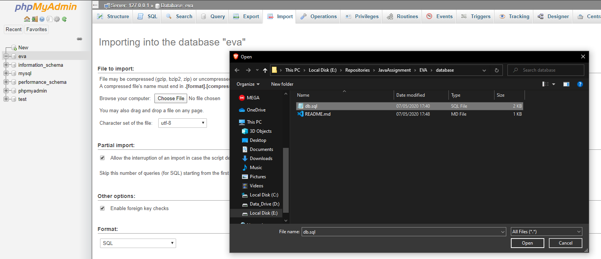

# How to export mySQL from phpMyAdmin

1. Click on `Export`:

2. Enter the name of the database that you want to export and select `Custom` export.

3. Click on view output as text (optional):

4. Scroll down and click `Go`.

5. Copy the code generated and paste it into a file with `.sql` as extension. i.e.: `mySql.sql`

# How to import mySQL into phpMyAdmin
1. Create a new database. In this case you should name it "`eva`", otherwise the java program will not find it. 

2. Click on your database, click `Import`, and choose the right `.sql` file.

# How to delete a database in phpMyAdmin 

Click on your database, then go under `Operations` and scroll down to find `Drop the database`.

