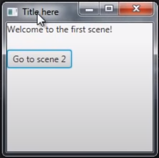
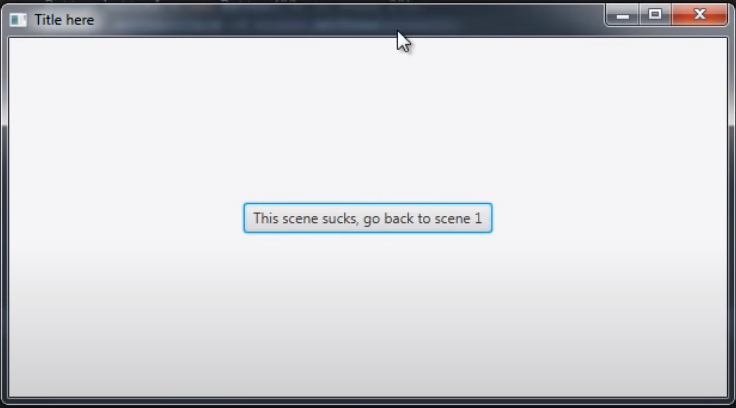
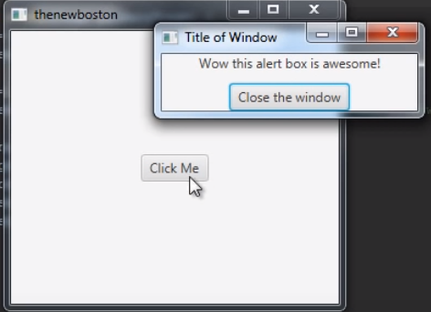
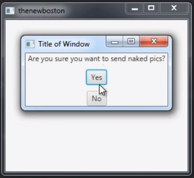
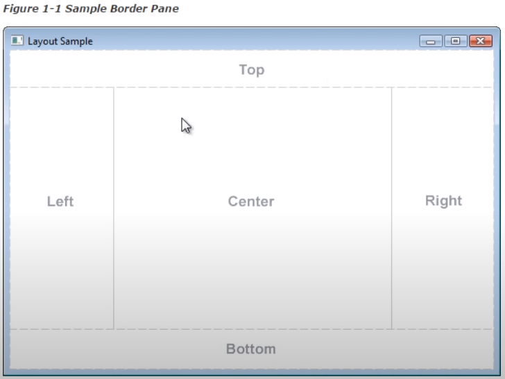
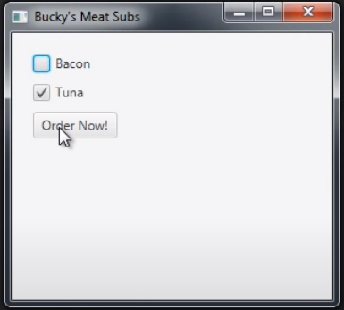
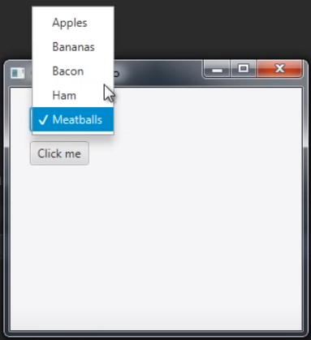
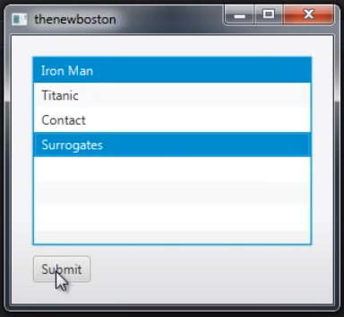

### Reference for Resources:
- [Original Tutorial Repository](https://github.com/buckyroberts/Source-Code-from-Tutorials/tree/master/JavaFX)
- ([JavaFx tutorials](https://www.youtube.com/watch?v=FLkOX4Eez6o&list=PL6gx4Cwl9DGBzfXLWLSYVy8EbTdpGbUIG))
# Useful Resources/ Look Up Material
- JavaFX
  - [Switching Scenes](./JavaFX/004_switchingScenes/Main.java)
    > 
    > 
  - [Alert Boxes](./JavaFX/005_creatingAlertBoxes)
    > 
  - [Confirm Boxes](./JavaFX/006_communicatingBetweenWindows)
    > 
  - [Running Code on Close](https://youtu.be/ZuHcl5MmRck)
  - Border Pane Layout
    > 
  - [Grid Pane Layout](./JavaFX/009_gridPane)
  - [Extract and Validate Input](./JavaFX/010_extractAndValidateInput)
  - [Check Boxes](./JavaFX/011_checkBoxes)
    > 
  - [ChoiceBox / Drop Down Menu](./JavaFX/012_choiceBoxDropDownList) (alternatively, [Listening for Selection Changes](./JavaFX/013_comboBox))
    > 
  - [List View](./JavaFX/015_listViews)
    > 