# Progress so far

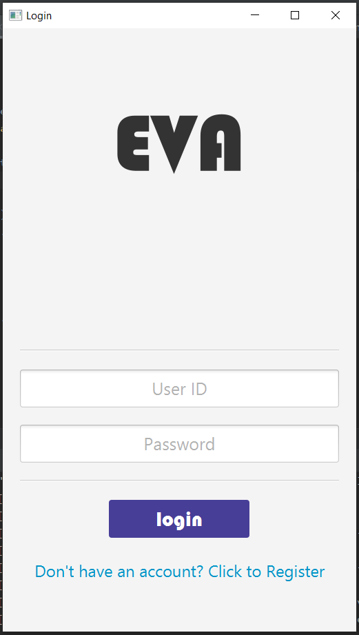

Starting pop up

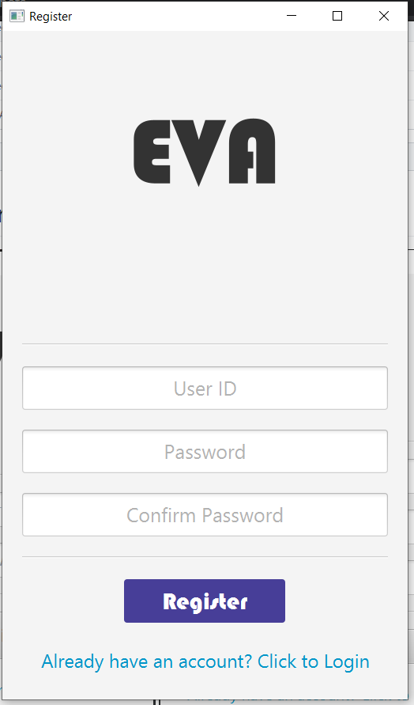

Register window

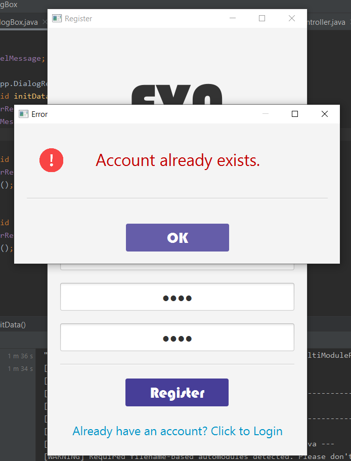

That is what happens if you enter ID that already exists

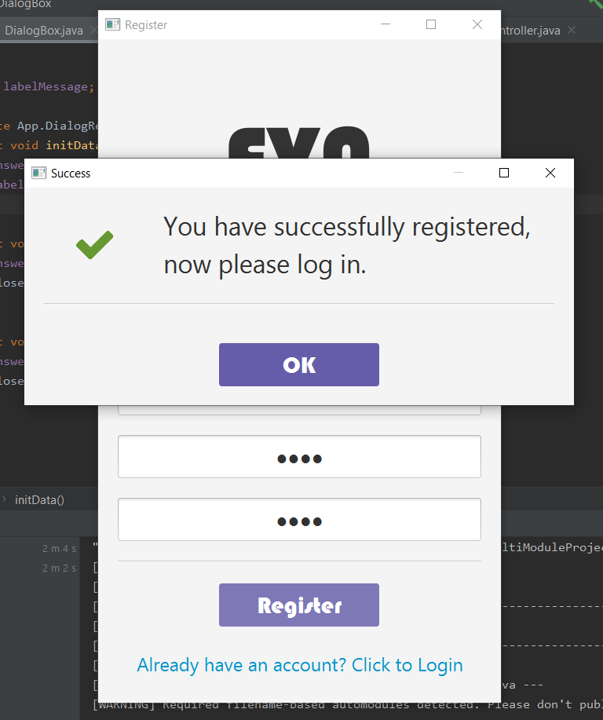

Succesful registeer

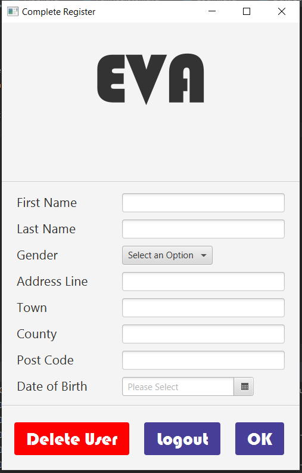

After you register and you log in you have to input your personal details

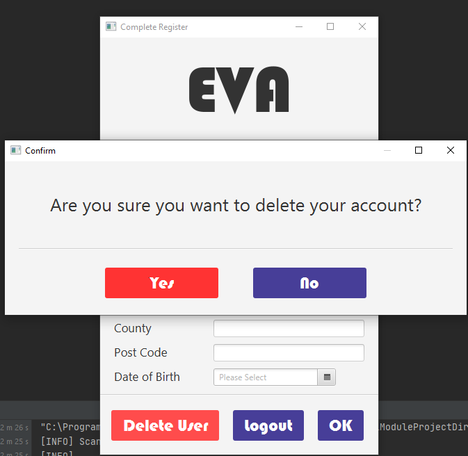

You can delete your account after login in for first time if some you made account by mistake 

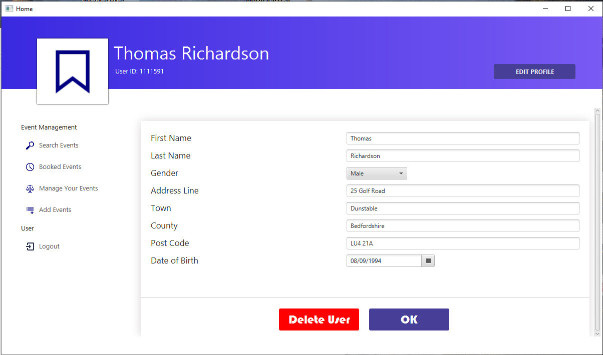

This is user profile section you can access after login where you can edit your personal details if made any mistake or you can delete 
your account

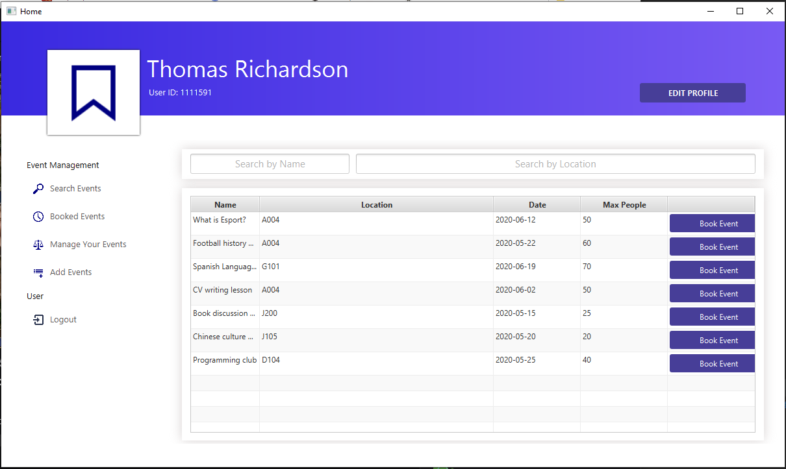

This is Search events tab that shows all events that you can book into if places are available

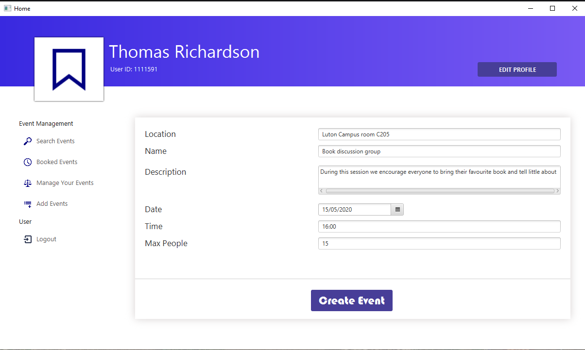

In this screen you can see event creation window that user can access if he was given permission  by admin

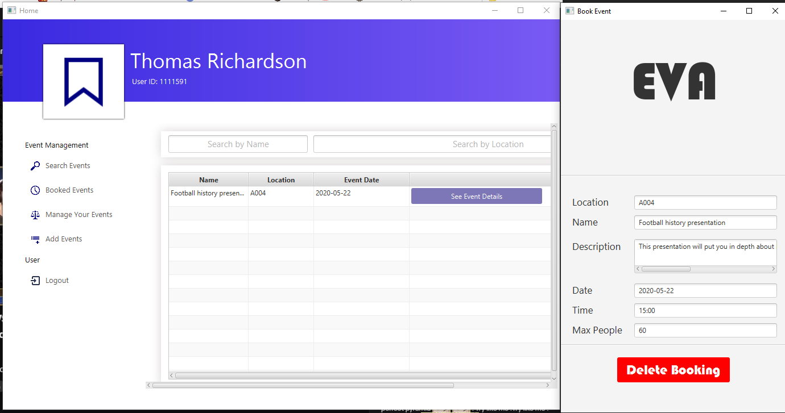

This screenshots shows "Booked events" tab that allows you to see  future booking and gives user option to delete their booking

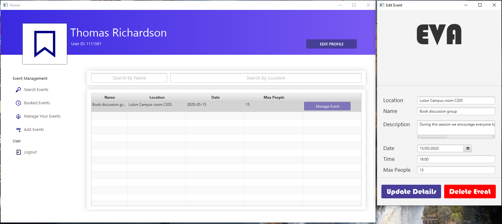

"Manage your events" tab allows you to edit details of event you have made and delete event if you wish to do so
