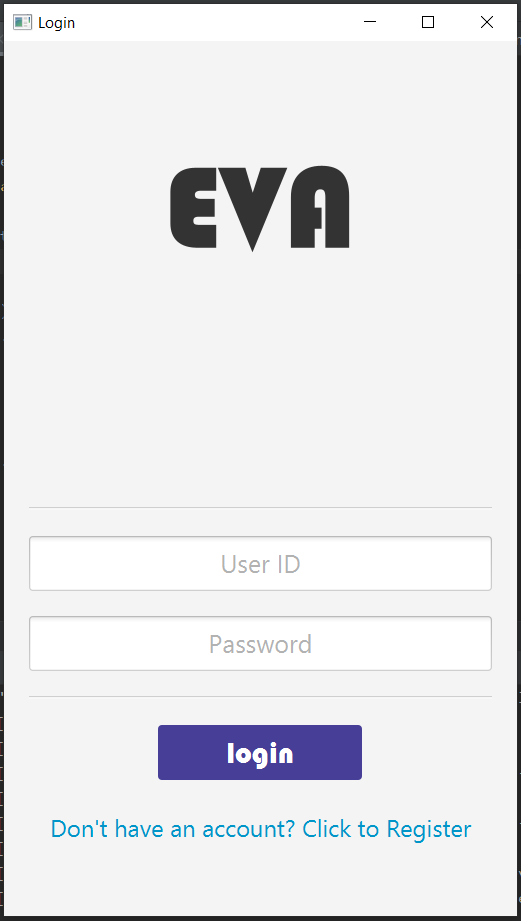
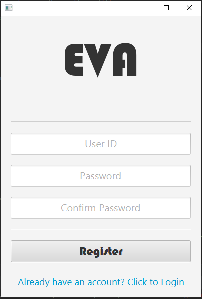
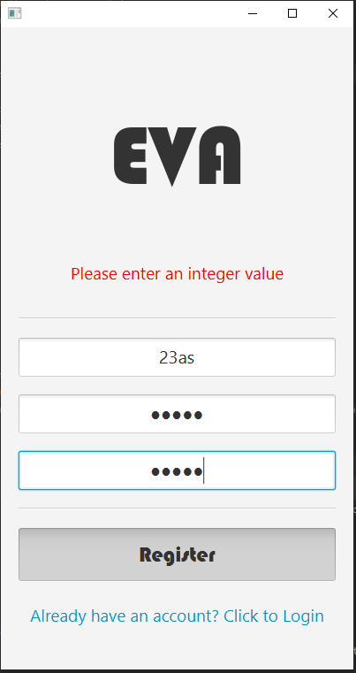
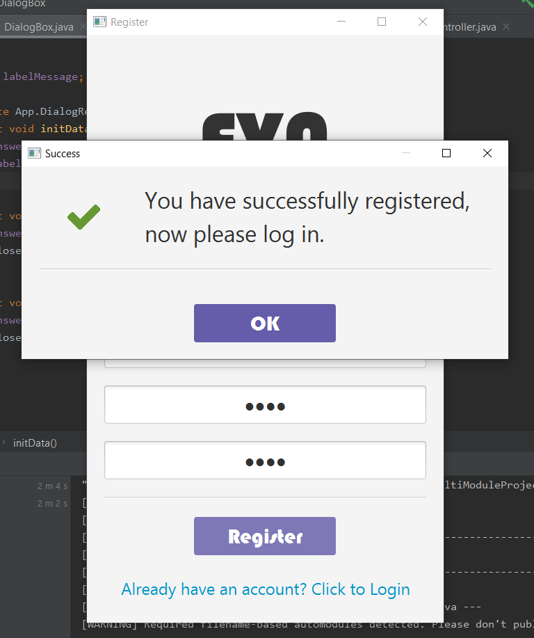
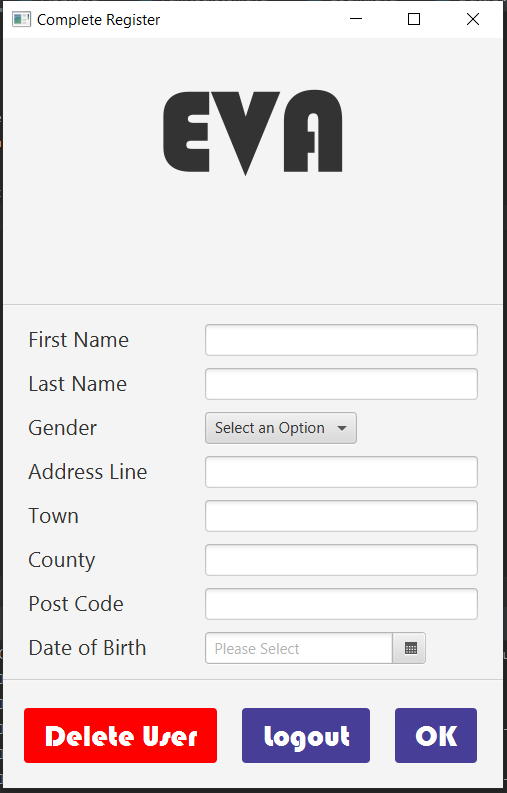
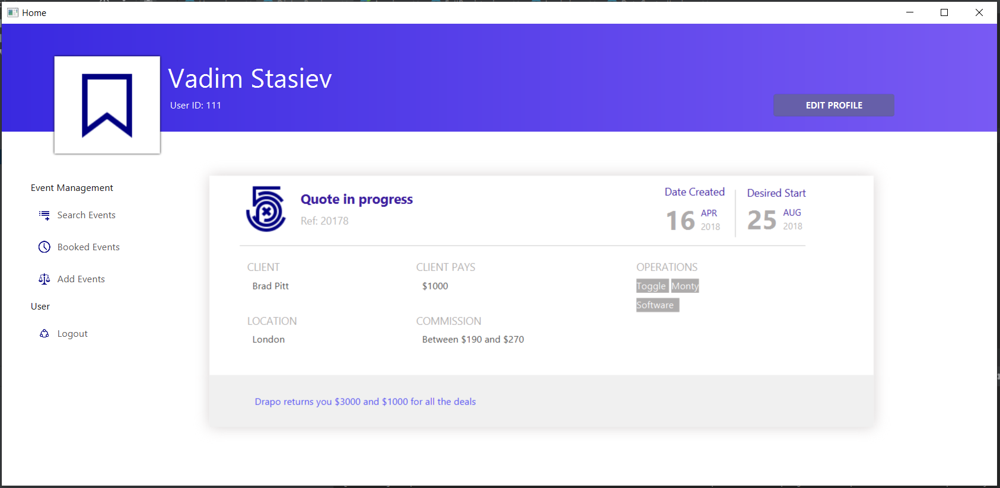
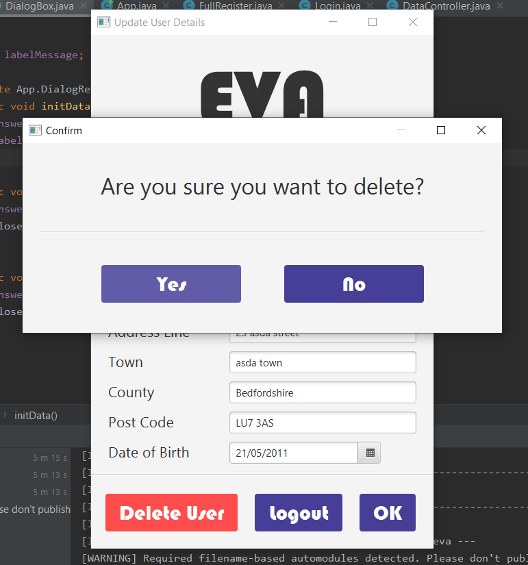

# Progress so far

What you see here is still in progress, that part in the middle is irrelevant and will be deleted I've just reused bits of an FXML design for the main page, but ill leave that there until i got something to replace it with.

By the time your reading this, this is probably already outdated.
